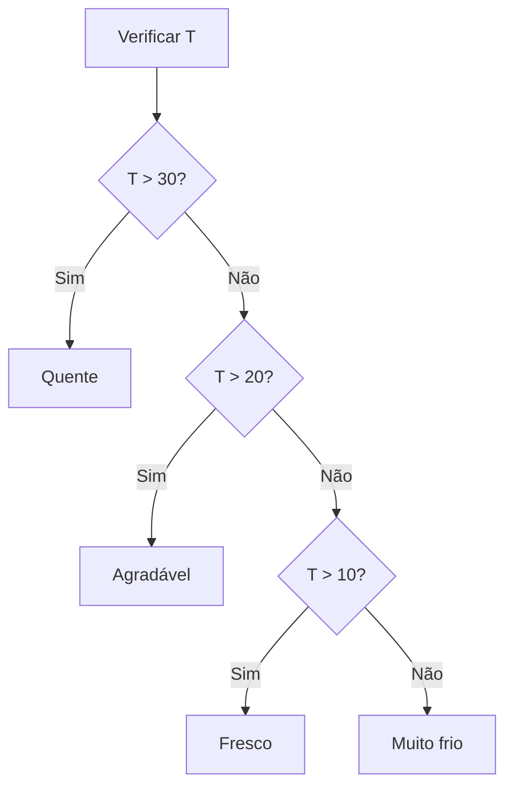

# 2. Estruturas de controle

As estruturas de controle determinam **como e quando** determinadas partes do código são executadas. Elas são fundamentais para expressar lógica, tomar decisões e repetir ações.

O objetivo desta seção é reforçar o raciocínio lógico e a capacidade de acompanhar o fluxo de execução de um programa.

---

## Estruturas condicionais: `if`, `else`, `else if`

Estas estruturas determinam a execução condicional de um bloco, ou seja, se os comandos dentro de chaves (`{}`) vão executar ou não, com base no valor booleano de uma expressão, chamada de **condição**.

As condições utilizam **operadores de comparação**, como `>=`, `<=`, `===`, `!==`, `>`, `<` e operadores lógicos, como `&&`, `||` e `!` para montar condições que definem quando um bloco de código será executado. O resultado da condição é sempre booleano: `true` ou `false`.

### `if`

A estrutura `if` permite executar um bloco de código apenas **se uma condição for verdadeira**.

```javascript
let idade = 18;

if (idade >= 18) {
  console.log("Maior de idade");
}
```

Se a condição for falsa, o bloco não é executado. O fluxo de execução continua com o código após o `if`.

**Exemplo:** Validar se um usuário pode acessar um recurso

```javascript
let usuario = {
  nome: "Ana",
  premium: true,
};

if (usuario.premium) {
  console.log(
    `Bem-vinda, ${usuario.nome}! Você tem acesso a todos os recursos.`,
  );
}
```

### `if` + `else`

Quando precisamos executar uma de duas ações possíveis, usamos `else`. Exatamente um dos dois blocos será executado.

```javascript
let nota = 6;

if (nota >= 7) {
  console.log("Aprovado");
} else {
  console.log("Reprovado");
}
```

O `else` é executado quando a condição do `if` é falsa.

**Exemplo:** Aplicar desconto ou preço cheio

```javascript
let valor = 150;
let temDesconto = true;
let precoFinal;

if (temDesconto) {
  precoFinal = valor * 0.9; // 10% de desconto
  console.log(`Preço com desconto: R$ ${precoFinal.toFixed(2)}`);
} else {
  precoFinal = valor;
  console.log(`Preço: R$ ${precoFinal.toFixed(2)}`);
}
```

### `else if`

Usado quando existem **várias condições possíveis**, mas apenas uma deve ser executada. Permite criar uma cadeia de decisões.

```javascript
let nota = 8;

if (nota >= 9) {
  console.log("Excelente");
} else if (nota >= 7) {
  console.log("Aprovado");
} else if (nota >= 5) {
  console.log("Recuperação");
} else {
  console.log("Reprovado");
}
```

> [!IMPORTANT]
> A avaliação ocorre de cima para baixo.
> Assim que uma condição é verdadeira, as demais são ignoradas.
> Por isso, a ordem das condições é importante!

**Exemplo:** Classificar temperatura

```javascript
let temperatura = 22;

if (temperatura > 30) {
  console.log("Quente! Use roupas leves.");
} else if (temperatura > 20) {
  console.log("Agradável! Ótimo tempo.");
} else if (temperatura > 10) {
  console.log("Fresco! Leve um casaco.");
} else {
  console.log("Muito frio! Use casaco pesado.");
}
```

**Fluxo de execução com `if/else if/else`:**



## Estrutura `switch`

O `switch` é uma alternativa ao uso de vários `else if` quando se deseja comparar um mesmo valor contra diferentes opções. É particularmente útil quando há muitas opções e o código fica mais legível.

### Sintaxe e funcionamento

```javascript
let dia = 3;

switch (dia) {
  case 1:
    console.log("Segunda-feira");
    break;
  case 2:
    console.log("Terça-feira");
    break;
  case 3:
    console.log("Quarta-feira");
    break;
  default:
    console.log("Dia inválido");
}
```

A estrutura funciona assim:

1. O valor de `dia` é avaliado uma única vez
2. O JavaScript procura um `case` que corresponda exatamente ao valor (usando `===`)
3. Se encontrar, começa a executar a partir desse ponto
4. O `break` interrompe a execução do `switch`
5. Se nenhum case corresponder, o bloco `default` é executado

**Comparação:** `if/else if` vs `switch`

Ambos resolvem o mesmo problema, mas em contextos diferentes:

| Aspecto          | `if/else if`                             | `switch`                             |
| ---------------- | ---------------------------------------- | ------------------------------------ |
| **Bom para**     | Condições complexas                      | Comparações contra múltiplos valores |
| **Legibilidade** | Melhor para poucas opções                | Melhor com muitas opções             |
| **Comparação**   | Qualquer operador (`>`, `<`, `===`, etc) | Apenas `===` (igualdade exata)       |
| **Exemplo**      | `if (x > 5 && y < 10)`                   | `switch (tipoUsuario)`               |

### Papel do `break`

O `break` interrompe a execução do switch, impedindo que o fluxo continue para o próximo `case`. Sem ele, ocorre o chamado **`fall-through`** (queda em cascata).

```javascript
let valor = 1;

switch (valor) {
  case 1:
    console.log("Um");
  case 2:
    console.log("Dois");
}

// Resultado SEM break:
// Um
// Dois

// Resultado COM break:
// Um
```

Observe: o segundo `case` é executado mesmo sem corresponder ao valor, porque não há `break` após o primeiro.

> [!WARNING]
> Esquecer o `break` é um erro comum e difícil de detectar. Use-o em cada `case`, a menos que o comportamento de queda seja intencional.

### _Fall-through_ intencional no `switch`

Apesar de frequentemente causar erros, o _fall-through_ pode ser usado de forma **intencional e controlada**, quando vários `cases` devem executar o mesmo código.

```javascript
let dia = 6;

switch (dia) {
  case 1:
  case 2:
  case 3:
  case 4:
  case 5:
    console.log("Dia útil");
    break;
  case 6:
  case 7:
    console.log("Fim de semana");
    break;
  default:
    console.log("Dia inválido");
}
```

Nesse exemplo:

- Se `dia` for 1, 2, 3, 4 ou 5, imprime "Dia útil"
- Se `dia` for 6 ou 7, imprime "Fim de semana"
- Os `cases` "caem" no mesmo bloco de forma controlada

O `break` evita que o código "caia" para o próximo grupo de `cases`.

**Exemplo:** Validar permissões de acesso

```javascript
let papel = "admin";

switch (papel) {
  case "admin":
  case "moderador":
    console.log("Pode deletar usuários");
    break;
  case "editor":
  case "autor":
    console.log("Pode criar conteúdo");
    break;
  case "visitante":
    console.log("Acesso somente leitura");
    break;
  default:
    console.log("Papel desconhecido");
}
```

## Laços de repetição

Laços permitem repetir um bloco de código diversas vezes enquanto uma condição for satisfeita. Eles são essenciais para processar coleções de dados, validações ou criar padrões.

### Quando usar cada laço?

| Laço         | Melhor para                     | Conhecemos o fim?             |
| ------------ | ------------------------------- | ----------------------------- |
| `for`        | Conhecer o número de repetições | Sim - geralmente              |
| `while`      | Condição complexa               | Não - depende de uma condição |
| `do...while` | Garantir execução mínima        | Não - mas pelo menos uma vez  |

### `for`

Usado quando o número de repetições é conhecido ou controlado por um contador. É o laço mais versátil.

```javascript
for (let i = 0; i < 5; i++) {
  console.log(i);
}

// Resultado:
// 0
// 1
// 2
// 3
// 4
```

**Estrutura do `for`:**

```
for (inicialização; condição; atualização) {
  // bloco de código
}
```

- **inicialização**: executada uma única vez, antes do laço começar
- **condição**: verificada antes de cada iteração
- **atualização**: executada após cada iteração

**Exemplo:** Tabuada

```javascript
let numero = 7;

for (let i = 1; i <= 10; i++) {
  let resultado = numero * i;
  console.log(`${numero} × ${i} = ${resultado}`);
}

// Resultado:
// 7 × 1 = 7
// 7 × 2 = 14
// 7 × 3 = 21
// ...
```

> [!IMPORTANT]
> A variável `i` é criada com `let`, então existe apenas dentro do laço.

**Variações do `for`:**

```javascript
// Regressivo (contador decrescente)
for (let i = 5; i > 0; i--) {
  console.log(i);
}

// Pulando valores
for (let i = 0; i < 20; i += 5) {
  console.log(i); // 0, 5, 10, 15
}

// Múltiplas variáveis
// Veja que o for continua com 3 partes separadas por ; em sua estrutura
for (let i = 0, j = 10; i < j; i++, j--) {
  console.log(`i=${i}, j=${j}`);
}
```

### `while`

Executa um bloco enquanto uma condição for verdadeira. A condição é verificada **antes** de cada execução.

```javascript
let contador = 0;

while (contador < 3) {
  console.log(contador);
  contador++;
}

// Resultado:
// 0
// 1
// 2
```

Use `while` quando a **condição é complexa** ou quando você não sabe quantas vezes o laço deve rodar.

**Exemplo:** Ler dados até uma entrada específica

```javascript
let senha = "";
let tentativas = 0;
let maxTentativas = 3;

while (tentativas < maxTentativas && senha !== "1234") {
  // Em um programa real, isso viria de uma entrada do usuário
  senha = prompt(`Senha (tentativa ${tentativas + 1}/${maxTentativas}):`);
  tentativas++;
}

if (senha === "1234") {
  console.log("Acesso permitido!");
} else {
  console.log("Acesso negado! Máximo de tentativas excedido.");
}
```

> [!WARNING]
> Se a condição nunca se tornar falsa, o laço será **infinito** e o programa travará!

```javascript
// Laço infinito!
let i = 0;
while (i < 10) {
  console.log(i);
  // Falta i++ - a condição nunca fica falsa
}
```

### `do...while`

Semelhante ao `while`, mas a condição é verificada **após** a execução. Isso garante que o bloco seja executado **pelo menos uma vez**.

```javascript
let numero = 5;

do {
  console.log(numero);
  numero++;
} while (numero < 3);

// Resultado:
// 5
// (mesmo com condição falsa, executa uma vez)
```

Compare com `while`:

```javascript
let numero = 5;

while (numero < 3) {
  console.log(numero); // Nunca é executado!
  numero++;
}
```

**Exemplo:** Menu que exige pelo menos uma entrada

```javascript
let opcao;

do {
  opcao = prompt("Escolha:\n1 - Continuar\n2 - Sair");

  if (opcao === "1") {
    console.log("Continuando...");
  } else if (opcao === "2") {
    console.log("Encerrando...");
  } else {
    console.log("Opção inválida! Tente novamente.");
  }
} while (opcao !== "2");
```

### `break` e `continue` em laços

#### `break`

Interrompe **completamente** o laço, passando para o código após o laço.

```javascript
for (let i = 0; i < 10; i++) {
  if (i === 5) {
    break; // Sai do laço
  }
  console.log(i);
}

// Resultado:
// 0 1 2 3 4
```

**Exemplo:** Procurar um valor em uma lista

```javascript
let numeros = [3, 7, 2, 8, 15, 4];
let procurando = 8;
let encontrado = false;

for (let i = 0; i < numeros.length; i++) {
  if (numeros[i] === procurando) {
    console.log(`Encontrado na posição ${i}`);
    encontrado = true;
    break; // Não precisa continuar procurando
  }
}

if (!encontrado) {
  console.log("Não encontrado");
}
```

#### `continue`

Interrompe apenas a **iteração atual**, pulando para a próxima iteração.

```javascript
for (let i = 0; i < 5; i++) {
  if (i === 2) {
    continue; // Pula esta iteração
  }
  console.log(i);
}

// Resultado:
// 0 1 3 4
```

**Exemplo:** Processando apenas números válidos

```javascript
let dados = [2, "texto", 5, null, 8, undefined, 1];

for (let i = 0; i < dados.length; i++) {
  if (typeof dados[i] !== "number") {
    continue; // Pula valores não numéricos
  }
  console.log(`Quadrado de ${dados[i]} é ${dados[i] ** 2}`);
}

// Resultado:
// Quadrado de 2 é 4
// Quadrado de 5 é 25
// Quadrado de 8 é 64
// Quadrado de 1 é 1
```

## Atividades sugeridas

1. Antes de executar, escreva o que será impresso no console. Qual é o valor de `x` ao final?

```javascript
let x = 0;

for (let i = 1; i <= 3; i++) {
  x += i;
}

console.log(x);
```

---

2. Antes de executar, escreva o que será impresso no console. Qual é a saída?

```javascript
let i = 0;

while (i < 5) {
  if (i === 3) {
    break;
  }
  console.log(i);
  i++;
}
```

---

3. Antes de executar, escreva o que será impresso no console. Qual é a saída?

```javascript
for (let i = 0; i < 5; i++) {
  if (i === 2) {
    continue;
  }
  console.log(i);
}
```

---

4. Antes de executar, escreva o que será impresso no console. Qual é o resultado final?

```javascript
let resultado = "";

for (let i = 1; i <= 3; i++) {
  for (let j = 1; j <= 2; j++) {
    resultado += `${i}${j},`;
  }
}

console.log(resultado);
```

---

5. Antes de executar, escreva o que será impresso no console. O que será impresso?

```javascript
let x = 5;

switch (x % 2) {
  case 0:
    console.log("Par");
    break;
  case 1:
    console.log("Ímpar");
    break;
  default:
    console.log("Inválido");
}
```

---

6. Antes de executar, escreva o que será impresso no console. Qual é o array final?

```javascript
let nums = [];

for (let i = 1; i <= 5; i++) {
  if (i % 2 === 0) {
    nums.push(i * 2);
  } else if (i > 3) {
    nums.push(i + 10);
  } else {
    nums.push(i);
  }
}

console.log(nums);
```

---

7. Antes de executar, escreva o que será impresso no console. Qual é o valor de `contador`?

```javascript
let contador = 0;
let i = 0;

do {
  i++;
  if (i % 2 === 0) {
    continue;
  }
  contador++;
} while (i < 6);

console.log(contador);
```

---

8. Crie um programa que:

- Comece em um número inicial
- Termine em um número final
- Mostre apenas os números pares
- É **obrigatório** que você use `continue` para pular números ímpares

```javascript
let inicio = 1;
let fim = 10;

// complete o código

// Saída esperada: 2 4 6 8 10
```

---

9. Simule um menu usando `switch`. O programa deve:

- Exibir as opções disponíveis
- Processar a escolha do usuário
- Executar a ação correspondente

Adicione validação para aceitar apenas números de 1 a 5.

```javascript
// Opções:
// 1 - Cadastrar
// 2 - Listar
// 3 - Atualizar
// 4 - Deletar
// 5 - Sair

let opcao = 2; // Simule uma entrada do usuário ou use prompt-sync

// Implemente o menu
```

---

10. Liste números de 1 a 20, mas:

- Por cada múltiplo de 3, escreva "Fizz"
- Por cada múltiplo de 5, escreva "Buzz"
- Por cada múltiplo de ambos, escreva "FizzBuzz"
- Pelos demais, escreva o número

---

11. Escreva um programa para determinar se um número é primo. Otimize para verificar apenas até `Math.sqrt(numero)`.

---

12. Crie um jogo em que o usuário tem uma determinada quantidade de tentativas para adivinhar um número e, conforme tenta adivinhar, o programa diz se o número é muito alto ou muito baixo.

---

13. Crie um programa que:

1. Receba um número de 1 a 12
1. Converta para mês (usando `switch`)
1. Mostre a estação do ano (usando `if/else`)

---

14. Encontre e exiba apenas números que não se repetem:

```javascript
let numeros = [1, 2, 2, 3, 4, 4, 5, 1];

// Restante do programa
```

---

15. Quando usar `if/else if` vs `switch`? Dê 3 exemplos onde cada um é melhor.

16. O que acontece quando um laço `for` tem uma condição que nunca é atingida?

17. Se um laço fica infinito, por que isso acontece geralmente?

18. Por que usar `break` em um laço melhora a performance?

19. Como estruturaria um programa com múltiplas validações?
